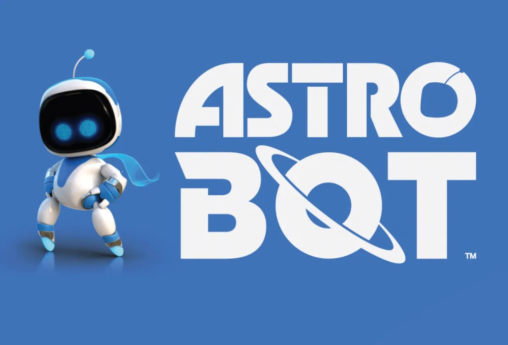
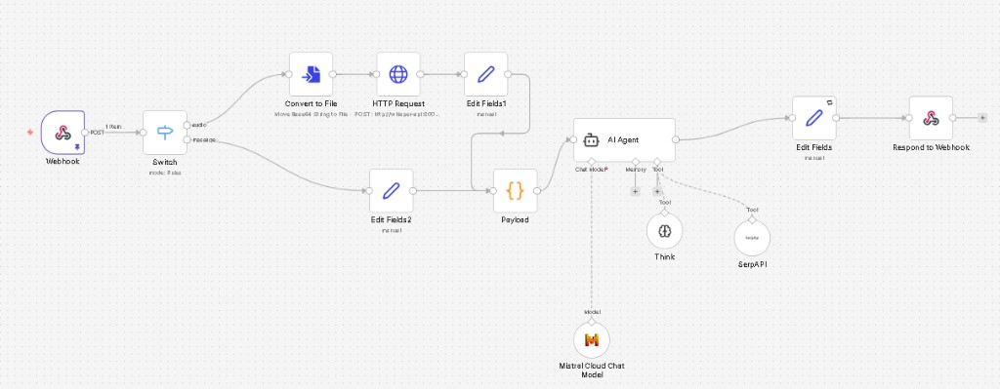

# AstroBot — Intelligent Space Assistant

AstroBot is a full-stack AI chat application with a space-themed UI inspired by the Astro Bot PlayStation game. It features JWT authentication, PostgreSQL persistence, and connects to an n8n AI workflow via webhook.

---

## Latest Update (Branding + Workflow)

### New Branding




### n8n Workflow Used by AstroBot



This workflow receives user text/audio from the backend webhook, transcribes audio when needed, sends the prompt to the AI Agent (Mistral + Think + SerpAPI), then returns the final answer back to AstroBot.

---

## Project Structure

```
astrobot/
├── frontend/
│   ├── index.html       Landing page with login/register buttons
│   ├── login.html       Login page
│   ├── register.html    Registration page
│   ├── chat.html        Main chat interface
│   ├── style.css        Shared stylesheet (Orbitron + Exo 2 fonts, glassmorphism)
│   └── script.js        Shared utilities (Auth, API wrapper, Toast, DOM helpers)
├── backend/
│   ├── server.js        Express server (CORS, Helmet, rate limiting, static serving)
│   ├── routes/
│   │   ├── auth.js      POST /api/auth/register, POST /api/auth/login
│   │   └── chat.js      POST /api/chat/message, GET /api/chat/history
│   ├── middleware/
│   │   └── auth.js      JWT Bearer token verification
│   ├── db/
│   │   └── index.js     PostgreSQL pool + table initialization
│   └── package.json
├── docker/
│   ├── Dockerfile       Multi-stage Node 18 Alpine build
│   └── docker-compose.yml  Connects to external n8n network
└── README.md
```

---

## Tech Stack

| Layer     | Technology                          |
|-----------|-------------------------------------|
| Frontend  | Vanilla HTML/CSS/JS (no framework)  |
| Backend   | Node.js + Express 4                 |
| Database  | PostgreSQL (via `pg` pool)          |
| Auth      | JWT (jsonwebtoken) + bcryptjs       |
| AI        | n8n webhook → your AI workflow      |
| Security  | Helmet, CORS, express-rate-limit    |
| Deploy    | Docker + Docker Compose             |

---

## Quick Start

### Development (local)

```bash
# 1. Install dependencies
cd backend
npm install

# 2. Set environment variables (or create a .env file)
export DB_HOST=localhost
export DB_PORT=5432
export DB_NAME=mydatabase
export DB_USER=tidiane
export DB_PASSWORD=tidkon
export JWT_SECRET=your_secret_key
export N8N_WEBHOOK=http://76.13.62.195:5678/webhook/astrobot

# 3. Start the server (serves ../frontend as static files in dev mode)
npm run dev
# or
npm start

# 4. Open http://localhost:3000
```

### Production (Docker)

```bash
# From the astrobot root directory:

# Make sure the n8n external network exists:
docker network ls | grep n8n_container_n8n-net

# Build and start AstroBot:
cd docker
docker-compose up -d --build

# Check logs:
docker-compose logs -f astrobot

# Stop:
docker-compose down
```

---

## Environment Variables

| Variable      | Default                                        | Description              |
|---------------|------------------------------------------------|--------------------------|
| `PORT`        | `3000`                                         | Server listening port    |
| `NODE_ENV`    | `development`                                  | Environment mode         |
| `JWT_SECRET`  | `astrobot_super_secret_key_2024`               | JWT signing secret       |
| `DB_HOST`     | `postgre_container`                            | PostgreSQL hostname      |
| `DB_PORT`     | `5432`                                         | PostgreSQL port          |
| `DB_NAME`     | `mydatabase`                                   | Database name            |
| `DB_USER`     | `tidiane`                                      | Database user            |
| `DB_PASSWORD` | `tidkon`                                       | Database password        |
| `N8N_WEBHOOK` | `http://76.13.62.195:5678/webhook/astrobot`    | n8n AI webhook URL       |

> **Important:** Change `JWT_SECRET` to a strong random string in production.

---

## API Reference

### Auth

#### `POST /api/auth/register`
```json
{
  "name": "Tidiane",
  "surname": "Konaté",
  "email": "tidiane@example.com",
  "password": "securepassword"
}
```
Returns `{ success, token, user }`.

#### `POST /api/auth/login`
```json
{
  "email": "tidiane@example.com",
  "password": "securepassword"
}
```
Returns `{ success, token, user }`.

### Chat (requires `Authorization: Bearer <token>`)

#### `POST /api/chat/message`
```json
{ "message": "Hello AstroBot!" }
```
Forwards to n8n webhook, saves response in DB, returns `{ success, data: { id, message, response, createdAt } }`.

#### `GET /api/chat/history`
Returns last 50 conversations in chronological order.

### Health

#### `GET /api/health`
Returns server status and version info.

---

## Database Schema

```sql
CREATE TABLE users (
  id            SERIAL PRIMARY KEY,
  name          VARCHAR(100) NOT NULL,
  surname       VARCHAR(100) NOT NULL,
  email         VARCHAR(255) UNIQUE NOT NULL,
  password_hash TEXT NOT NULL,
  created_at    TIMESTAMP DEFAULT CURRENT_TIMESTAMP
);

CREATE TABLE conversations (
  id         SERIAL PRIMARY KEY,
  user_id    INTEGER REFERENCES users(id) ON DELETE CASCADE,
  message    TEXT NOT NULL,
  response   TEXT,
  created_at TIMESTAMP DEFAULT CURRENT_TIMESTAMP
);
```

---

## n8n Webhook Integration

When a user sends a message, the backend posts to your n8n webhook:

```json
{
  "user_id": 1,
  "message": "What's the distance to Alpha Centauri?",
  "user_name": "Tidiane",
  "user_email": "tidiane@example.com"
}
```

Your n8n workflow should return a JSON body with one of these fields:
- `response`
- `message`
- `output`
- `text`
- `answer`

---

## Security Features

- **Helmet** — sets secure HTTP response headers
- **CORS** — restricted to known origins in production
- **Rate limiting** — 200 req/15min globally, 20 auth req/15min, 30 chat req/min
- **bcryptjs** — passwords hashed with salt rounds = 12
- **JWT** — tokens expire after 7 days
- **Non-root Docker user** — container runs as `astrobot` user

---

## Design

- Fonts: **Orbitron** (headings) + **Exo 2** (body) via Google Fonts
- Color palette: Deep space blues + electric cyan (#00b4d8)
- Glassmorphism cards with backdrop-filter blur
- Animated star background (CSS radial gradients)
- Floating robot animation (CSS keyframes)
- Inline SVG AstroBot mascot with glowing eyes + antenna

---

## Team

AstroBot is a **university graduation project** developed by:

- **Tidiane Konaté**
- **Sidi Mohamed Sall**
- **Ahmed Essalem**
- **Saad Ibrahim Houssein**

— 2026
